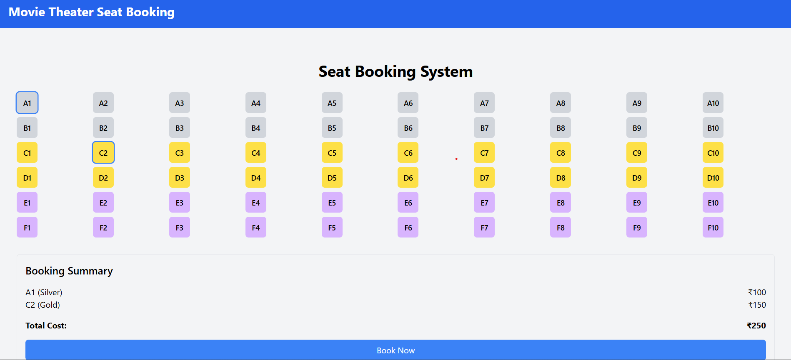

# Interactive Seat Booking System  

The **Interactive Seat Booking System** is a dynamic and user-friendly web application designed for movie theaters or event venues. It enables users to select seats, view real-time pricing, and book tickets seamlessly with intuitive controls and a visually engaging interface.  

---

## Key Features  

1. **Seat Layout**  
   - Displays a 6x10 grid of seats with unique identifiers (e.g., "A1", "B5").  
   - Color-coded seat tiers:  
     - Silver: ₹100 (Front rows).  
     - Gold: ₹150 (Middle rows).  
     - Platinum: ₹200 (Back rows).  
   - Interactive seat selection and deselection.  

2. **Dynamic Pricing**  
   - Real-time price updates as seats are selected or deselected.  
   - Total cost is dynamically calculated and displayed.  

3. **Booking Summary**  
   - Displays the list of selected seats, their prices, and the total cost.  
   - Includes a "Book Now" button with a confirmation modal for finalizing the booking.  

4. **Selection Constraints**  
   - Users can select up to 8 seats.  
   - Error message shown if the limit is exceeded.  

5. **Responsive UI**  
   - Clean, modern design using Tailwind CSS.  
   - Optimized for both desktop and mobile devices.  

---

## How It Works  

1. View the seat layout and choose desired seats.  
2. Watch the total cost update dynamically as you select/deselect seats.  
3. Review selected seats and finalize booking via the summary section.  

---

## Demo  

[Live Demo](https://ananthuspace.github.io/Interactive-Seat-Booking-System)  

---

## Screenshots  

### Seat Layout  
  

---

## Getting Started  

### Prerequisites  
Ensure you have the following installed:  
- Node.js (>=16.0)  
- npm (>=7.0)  

### Installation  

1. Clone the repository:  
   ```bash
   git clone https://github.com/AnanthuSpace/Interactive-Seat-Booking-System.git
